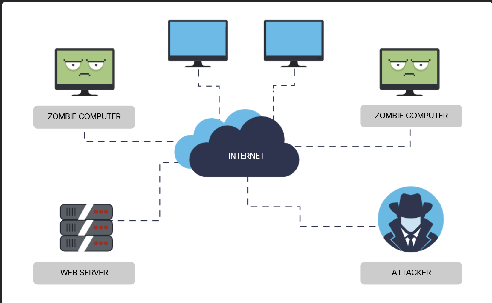
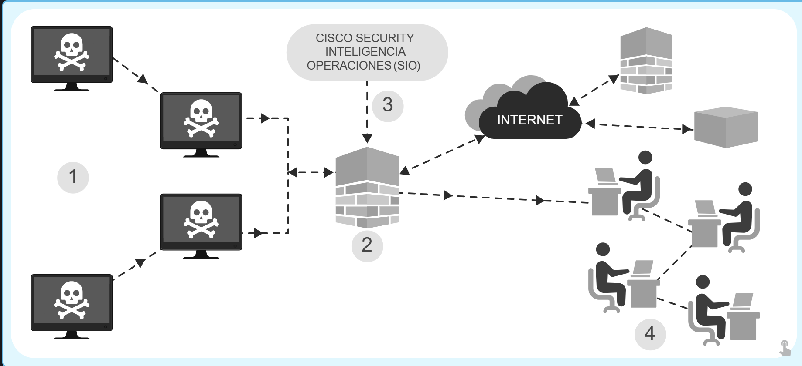

## Ingeniería Social

La ingeniería social es la manipulación de las personas para que realicen acciones o divulguen información confidencial. Los ingenieros sociales con frecuencia dependen de la disposición de las personas para ayudar, pero también se aprovechan de sus vulnerabilidades.

Por ejemplo, un atacante llamará a un empleado autorizado con un problema urgente que requiere acceso inmediato a la red, y apelará a la vanidad o la codicia del empleado, o invocará la autoridad mediante el uso de técnicas de *name-dropping* (mencionar nombres importantes) para obtener este acceso.

* **Pretexto:** Ocurre cuando un atacante se comunica con una persona y miente en un intento de obtener acceso a datos privilegiados. Por ejemplo, fingir que necesita los datos personales o financieros de una persona para confirmar su identidad.
* **Infiltración (Tailgating):** Sucede cuando un atacante sigue rápidamente a una persona autorizada para ingresar a un lugar seguro o área restringida.
* **Una cosa por otra (Quid pro quo):** Sucede cuando un atacante solicita información personal a cambio de algo, como un regalo gratuito o un servicio.

## Denegación de Servicio (DoS)

Los ataques de denegación de servicio (DoS) son un tipo de ataque de red que es relativamente sencillo de llevar a cabo, incluso por parte de un atacante no cualificado. Un ataque DoS da como resultado cierto tipo de interrupción del servicio de red a los usuarios, los dispositivos o las aplicaciones.

* **Cantidad abrumadora de tráfico:** Ocurre cuando se envía una cantidad masiva de datos a una red, host o aplicación a una velocidad que no se puede procesar. Esto ocasiona una disminución en la velocidad de transmisión y respuesta, o una falla total en un dispositivo o servicio.
* **Paquetes maliciosos formateados:** Un paquete es una colección de datos que fluye entre un origen (computadora o aplicación) y un receptor a través de una red como Internet. Cuando se envía un paquete con formato malicioso, el receptor no puede manejarlo. Por ejemplo, si un atacante envía paquetes que contienen errores o están formateados incorrectamente y no pueden ser identificados por una aplicación, hará que el dispositivo receptor funcione muy lentamente o se bloquee por completo.

## DoS Distribuido (DDoS)

Un ataque DoS distribuido (DDoS) es similar a un ataque DoS, pero proviene de múltiples fuentes coordinadas. Por ejemplo:

* Un atacante crea una red (botnet) de hosts infectados, llamados "zombis", que son controlados por sistemas de manejo o comando.
* Las computadoras zombis analizan constantemente la red e infectan más hosts, creando más y más zombis.
* Cuando está listo, el atacante proporciona instrucciones a los sistemas de control para que la botnet de zombis lleve a cabo el ataque DDoS.

## Botnet

Una computadora "bot" se infecta generalmente al visitar un sitio web comprometido, abrir un archivo adjunto de correo electrónico o ejecutar un archivo multimedia infectado. Una **botnet** es un grupo de bots conectados a través de Internet que normalmente se controlan mediante un servidor de Comando y Control (C&C). 

Estos bots se pueden activar para distribuir malware, lanzar ataques DDoS, enviar correo electrónico no deseado (Spam) o ejecutar ataques de contraseñas por fuerza bruta. Los ciberdelincuentes suelen alquilar sus botnets a terceros con fines maliciosos. Muchas organizaciones, como Cisco, filtran las actividades de red a través de sistemas de detección de tráfico de botnets para identificar y bloquear cualquier ubicación de la botnet.

1. Los bots infectados intentan comunicarse con un host de comando y control en Internet.
2. El filtro de botnet del Firewall de Cisco es una función que detecta el tráfico procedente de dispositivos infectados con el código de botnet malicioso.
3. El servicio Cisco Security Intelligence Operations (SIO) basado en la nube envía filtros actualizados al firewall que coinciden con el tráfico de las nuevas botnets conocidas.
4. Las alertas se envían al equipo de seguridad interno de Cisco para notificarles sobre los dispositivos infectados que generan tráfico malicioso para que puedan prevenirlos, mitigarlos y remediarlos.

## Ataques en el camino

Los atacantes en ruta interceptan o modifican las comunicaciones entre dos dispositivos, como un navegador web y un servidor web, ya sea para recopilar información de uno de los dispositivos o para hacerse pasar por uno de ellos.

Este tipo de ataque también se conoce como ataque de hombre en el medio (Man-in-the-Middle) o de hombre en el móvil (Man-in-the-Mobile).

* **Hombre en el medio (MitM):** Un ataque MitM ocurre cuando un ciberdelincuente toma control de un dispositivo sin que el usuario lo sepa. Con este nivel de acceso, el atacante puede interceptar y capturar la información sobre el usuario antes de retransmitirla a su destino. Estos tipos de ataques se utilizan a menudo para robar información financiera. Hay muchos tipos de malware que poseen capacidades de ataque MitM.
* **Hombre en el móvil (MitMO):** Una variación del hombre en el medio, el MitMO es un tipo de ataque utilizado para tomar el control de dispositivos móviles. Cuando está infectado, el dispositivo móvil recibe instrucciones de filtrar información confidencial del usuario y enviarla a los atacantes. ZeuS es un ejemplo de paquete de malware con capacidades de MitMO; permite a los atacantes capturar silenciosamente los mensajes SMS de verificación en dos pasos (2FA) que se envían a los usuarios.|