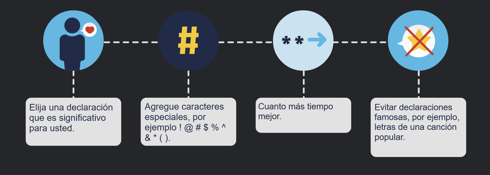

Cuando está lejos de casa, puede acceder a su información en línea y navegar por internet a través de redes inalámbricas públicas o puntos de acceso Wi-Fi. Sin embargo, hay algunos riesgos involucrados, lo que significa que es mejor no acceder ni enviar ninguna información personal cuando se usa una red Wi-Fi pública.

Siempre debe verificar que su dispositivo no esté configurado para compartir archivos y datos multimedia, y que requiera la autenticación de usuario con cifrado.

También debe usar un servicio de VPN encriptado para evitar que otras personas intercepten su información (lo que se conoce como «espionaje») a través de una red inalámbrica pública. Este servicio le brinda acceso seguro a internet, al cifrar la conexión entre su dispositivo y el servidor VPN. Incluso si los hackers interceptan una transmisión de datos en un túnel VPN encriptado, no podrán descifrarla.

Sus dispositivos informáticos son el portal hacia su vida en línea, almacenando muchos de sus datos personales. Por lo tanto, es importante proteger la seguridad de sus dispositivos.

## Encienda el firewall
Debe usar al menos un tipo de firewall (ya sea un firewall de software o un firewall de hardware en un enrutador) para proteger su dispositivo del acceso no autorizado. El firewall debe activarse y actualizarse constantemente para evitar que los hackers accedan a sus datos personales o de la organización.

## Instale el antivirus y el antiespía
El software malintencionado, como virus y spyware (programa espía), está diseñado para obtener acceso no autorizado a su equipo y a sus datos. Una vez instalados, los virus pueden destruir los datos y ralentizar el equipo. Incluso pueden tomar su computadora y emitir correos electrónicos no deseados con su cuenta. El spyware puede supervisar sus actividades en línea, recopilar su información personal o enviar anuncios emergentes no deseados a su navegador web mientras está en línea.

Para evitarlo, solo debe descargar software de sitios web de confianza. Sin embargo, siempre debe utilizar un software antivirus para proporcionar otra capa de protección. El software, que usualmente incluye antispyware, está diseñado para analizar su computadora y correo electrónico entrante para detectar virus y eliminarlos. Mantener su software actualizado protegerá a su computadora de cualquier software malicioso reciente.

## Administre su sistema operativo o navegador web
Los hackers siempre intentan aprovechar las vulnerabilidades que pueden existir en su sistema operativo (como Microsoft Windows o macOS) o en el navegador web (como Google Chrome o Apple Safari).

De este modo, para proteger su computadora y sus datos, debe establecer la configuración de seguridad en su computadora o navegador a un nivel medio o alto. También debe actualizar el sistema operativo de la computadora, incluyendo los navegadores web, y descargar e instalar periódicamente parches y actualizaciones de seguridad del software de los proveedores.

## Configure la protección de contraseñas
Todos sus dispositivos informáticos, ya sean ordenadores, computadoras portátiles, tabletas o teléfonos inteligentes, deben estar protegidos con contraseña para evitar el acceso no autorizado. Cualquier información almacenada debe estar cifrada, especialmente en el caso de datos sensibles o confidenciales. Solo debe almacenar la información necesaria en su dispositivo móvil, en caso de que se lo roben o se pierda.

Recuerde, si alguno de sus dispositivos se ve comprometido, los delincuentes pueden tener acceso a todos sus datos a través del proveedor de servicios de almacenamiento en la nube, como iCloud o Google Drive.

> **NOTA**: Todos sus dispositivos informáticos, ya sean ordenadores, computadoras portátiles, tabletas o teléfonos inteligentes, deben estar protegidos con contraseña para evitar el acceso no autorizado. Cualquier información almacenada debe estar cifrada, especialmente en el caso de datos sensibles o confidenciales. Solo debe almacenar la información necesaria en su dispositivo móvil, en caso de que se lo roben o se pierda.
> Recuerde, si alguno de sus dispositivos se ve comprometido, los delincuentes pueden tener acceso a todos sus datos a través del proveedor de servicios de almacenamiento en la nube, como iCloud o Google Drive.

## Seguridad de la red inalámbrica en casa
Las redes inalámbricas permiten que los dispositivos habilitados con Wi-Fi, como computadoras portátiles y tabletas, se conecten a la red por medio de un identificador de red conocido como identificador de conjunto de servicios (SSID). Si bien un enrutador inalámbrico se puede configurar para que no transmita el SSID, esto no debe considerarse una seguridad adecuada para una red inalámbrica.

Los hackers conocerán el SSID preestablecido y la contraseña predeterminada. Por lo tanto, estos detalles deben cambiarse para evitar que los intrusos entren en la red inalámbrica doméstica. Además, debe encriptar la comunicación inalámbrica habilitando la seguridad inalámbrica y la función de encriptado WPA2 en el enrutador inalámbrico. Pero tenga en cuenta que, incluso con el cifrado WPA2 habilitado, una red inalámbrica puede seguir siendo vulnerable.

Esta vulnerabilidad puede ser atacada utilizando el Ataque de Reinstalación de Clave (KRACK, Key Reinstallation Attack) por intrusos. En términos sencillos, los atacantes rompen el cifrado entre un enrutador inalámbrico y un dispositivo inalámbrico, lo que les da acceso a los datos de la red. Esta falla afecta a todas las redes Wi-Fi modernas y protegidas.

Para mitigar esta situación, debe:

* Actualizar todos los productos afectados como enrutadores inalámbricos, computadoras portátiles y dispositivos móviles, tan pronto como las actualizaciones de seguridad estén disponibles.
* Usar una conexión por cable para cualquier dispositivo con una tarjeta de interfaz de red (NIC) con cable.
* Utilizar un servicio de red privada virtual (VPN) de confianza al acceder a una red inalámbrica.

## Riesgos del Wi-Fi público
Cuando está lejos de casa, puede acceder a su información en línea y navegar por internet a través de redes inalámbricas públicas o puntos de acceso Wi-Fi. Sin embargo, hay algunos riesgos involucrados, lo que significa que es mejor no acceder ni enviar ninguna información personal cuando se usa una red Wi-Fi pública.

Siempre debe verificar que su dispositivo no esté configurado para compartir archivos y datos multimedia, y que requiera la autenticación de usuario con cifrado.

También debe usar un servicio de VPN encriptado para evitar que otras personas intercepten su información (lo que se conoce como «espionaje») a través de una red inalámbrica pública. Este servicio le brinda acceso seguro a internet, al cifrar la conexión entre su dispositivo y el servidor VPN. Incluso si los hackers interceptan una transmisión de datos en un túnel VPN encriptado, no podrán descifrarla.

> **NOTA IMPORTANTE**
> 
> **Wifi de Acceso Público**
> * Verifica la red: Asegúrate de que la red sea legítima consultando con los empleados del lugar para evitar conectarte a redes impostoras creadas por ciberdelincuentes.
> * Navega seguro: Ingresa únicamente a sitios web cuya dirección comience con "https" (la "s" garantiza que la información viaja encriptada).
> * Evita conexiones automáticas: Configura tu celular para que no se conecte por sí solo a redes wifi desconocidas.
> * Utiliza una VPN: Si te conectas frecuentemente a redes públicas, usa una Red Virtual Privada (VPN) para codificar tus transmisiones.
> * Prioriza tus datos móviles: Para enviar información confidencial, siempre es más seguro usar tu plan de datos celulares que el wifi público.
> 
> **Seguridad para Bluetooth**
> * Apágalo cuando no lo uses: Esto evita que dispositivos maliciosos detecten tu historial de conexiones o accedan a tu equipo.
> * Cuidado con los vehículos: Si vinculas tu teléfono al sistema de un auto alquilado (o al tuyo si lo vas a vender), recuerda desvincularlo y borrar toda tu información antes de entregarlo.
> * Usa el modo oculto: Configura tu Bluetooth como "oculto" (hidden) en lugar de "detectable" (discoverable) para que personas desconocidas no rastreen tu señal.
> 
> **Seguridad en Redes Domésticas (Wifi de casa)**
> * Personaliza tu red: Cambia el nombre de red (SSID) que viene de fábrica por uno que no revele la marca del router y que sea difícil de adivinar.
> * Cambia la contraseña de fábrica: Modifica la clave de administración predeterminada del router tan pronto como lo instales.
> * Filtro de direcciones MAC: Como medida extra de seguridad, configura tu router para que solo acepte conexiones de dispositivos (direcciones físicas/MAC) que tú hayas aprobado previamente.
> * Apágalo si sales: Desactiva tu router si no lo vas a usar por un periodo prolongado de tiempo.
> 
> **Codificación y Contraseñas**
> * Elige la mejor encriptación: Asegúrate de que tu router utilice los estándares de seguridad WPA3 o WPA2. Evita a toda costa el sistema WEP, ya que es obsoleto y vulnerable.
> * Crea contraseñas robustas: Usa combinaciones largas de letras, números y símbolos. Evita datos obvios como palabras comunes o cumpleaños.
> * No recicles claves: Nunca uses la misma contraseña para múltiples cuentas, especialmente si se trata de servicios bancarios, médicos o correos importantes.

## Estos son algunos consejos para crear una buena frase de contraseña.

## Guia para la contraseña 
El Instituto Nacional de Normas y Tecnología (NIST) de los Estados Unidos publicó requisitos de contraseña mejorados. Las normas del NIST están destinadas a aplicaciones del gobierno, pero también pueden servir como normas para otras.

Estas pautas tienen como objetivo colocar la responsabilidad de la verificación del usuario en los proveedores de servicios y garantizar una mejor experiencia para los usuarios en general. Ellos afirman:

Las contraseñas deben tener por lo menos 8  caracteres, pero no más de 64.
No utilice contraseñas comunes ni que se puedan adivinar con facilidad; por ejemplo, «contraseña», «abc123».
No deben haber reglas de composición, como incluir números y letras mayúsculas y minúsculas.
Los usuarios deben poder ver la contraseña al escribir, para ayudar a mejorar la precisión.
Se deben permitir todos los caracteres de impresión y espacios.
No debe haber sugerencias para la contraseña.
No debe haber periodo de caducidad de contraseña.
No debe haber autenticación basada en el conocimiento, como tener que proporcionar respuestas a preguntas secretas o verificar el historial de transacciones.

